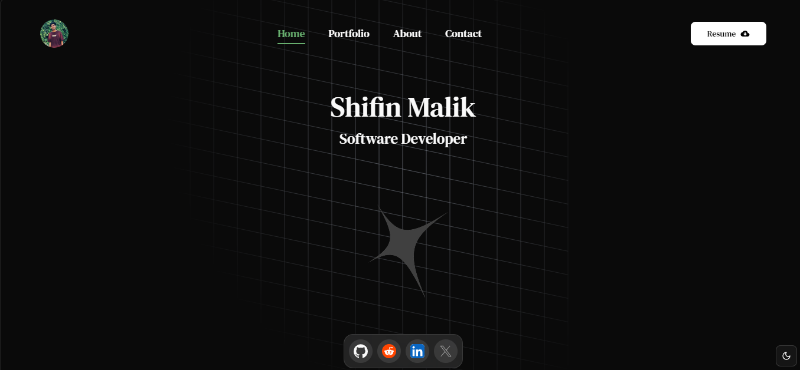

# 🌟 Portfolio Website

A modern and responsive developer portfolio built using **React**, **Vite**, and **Tailwind CSS v4**. Enhanced with beautiful animations and UI components from **Magic UI**, **Aceternity UI**, and **shadcn/ui**.

---

## 🔧 Tech Stack

- ⚛️ **React** – Frontend Library  
- ⚡ **Vite** – Build Tool  
- 🎨 **Tailwind CSS v4** – Utility-first CSS framework  
- 🧙‍♂️ **Magic UI** – Modern UI animations  
- 🌌 **Aceternity UI** – Elegant UI components  
- 💅 **shadcn/ui** – Accessible and customizable component library  

---

## 📸 Preview



---

## 🚀 Features

- ✅ Fully responsive design  
- ✨ Smooth animations and transitions  
- 🧩 Reusable and customizable components  
- 🌙 Dark mode support  
- 💡 Modern UI/UX experience  
- 🔧 Easy to configure with your personal data  

---

## 📦 Installation

Clone the repository and install dependencies:

```bash
git clone https://github.com/Shifin-Malik/Shifin-Malik.github.io.git
cd portfolio

🛠️ Usage
pnpm run dev
pnpm run build
pnpm run preview


👥 Contributors
Shifin Malik – GitHub

Team Members
(You can list names or GitHub usernames here if applicable)


💬 Support & Contribution
For any queries, feel free to raise an issue or contribute by submitting a pull request. Your feedback is welcome!


